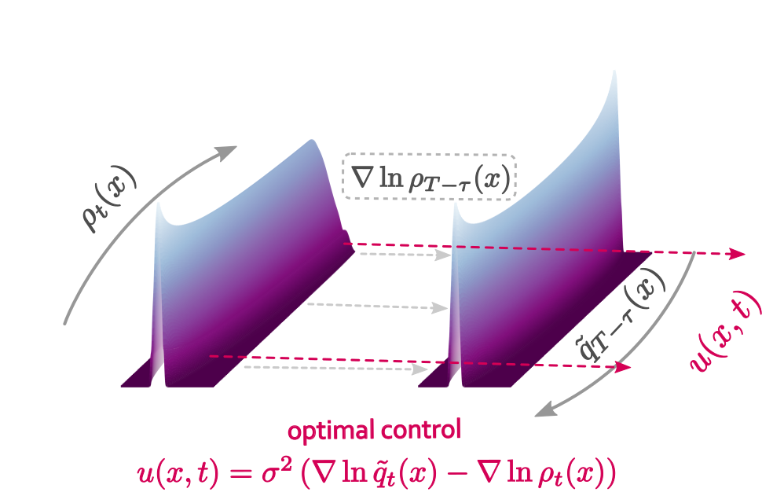

.. DeterministicParticleFlowControl documentation master file, created by sphinx-quickstart on Tue Dec 14 10:29:06 2021. This should at least contain the root `toctree` directive.

Welcome to DeterministicParticleFlowControl's documentation!
====================================

`Deterministic Particle Flow Control` 
is a deterministic particle-based stochastic optimal control framework implemented in Python. 

ndent optimal controls are extracted at every time step as the difference of the logarithmic gradients of the two sampled flows rescaled by the noise variance of the process.
  

For a fast introduction on how to use it, please refer to the `README file 
<https://github.com/dimitra-maoutsa/DeterministicParticleFlowControl/blob/main/README.md>`_ in the Github repository. Here you will find more detailed descriptions of the components. (this documentation is getting updated.)

Contents:

.. toctree::
   :maxdepth: 2
   
   theory
   auto_examples/index
   api
   DeterministicParticleFlowControl/DeterministicParticleFlowControl
   DeterministicParticleFlowControl/optimal_transport_reweighting   
   DeterministicParticleFlowControl/score_function_estimators
   
   
.. toctree::
   :hidden:
   :maxdepth: 3
    
   theory
   api

    
   
   This is a documentation of the software using sphinx_. 

.. _sphinx: http://sphinx-doc.org/
