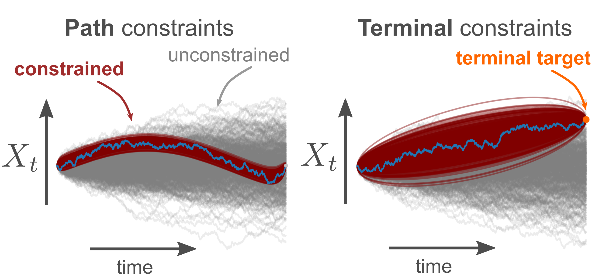

========================
Setting
========================

We consider a stochastic system described by a stochastic differential equation (SDE) 

.. math::

    dX_t = f(X_t,t) dt + \sigma(x,t) dW_t

with drift :math:`f(x,t)` and diffusion :math:`\sigma(x,t)`.

We want to constrain the dynamics of this system for a time interval :math:`[0,\,T]` 

- either to reach some target state :math:`x^*` at time T   (**terminal constraint**), 
- and/or to visit/avoid specific regions of the state space (**path constraints**).  

We implement the constraints in terms a time- and state-dependent perturbation of the deterministic part of the dynamics, i.e. we apply interventions :math:`u(x,t)` and the controlled system dynamics become

.. math::

    dX_t = f(X_t,t) dt + u(x,t) dt + \sigma(x,t) dW_t.

Following the assumptions of the Path Integral control formalism, i.e. assuming that control costs are inversely proportional of noise variance (see [Maoutsa2021a]_ , [Maoutsa2021b]_ for more details), we can show that the interventions :math:`u(x,t)` can be obtained from the **logarithmic gradient of the solution of a backward partial differential equation** rescaled by the noise variance. 

Here, instead of solving the backward PDE to obtain the optimal drift adjustment that implements the constraints, we express the optimal interventions as the **difference of the logarithmic gradient of two probability flows**, :math:`\rho_t(x)` and :math:`q_t(x)`. The probability flow or density :math:`\rho_t(x)` satisfies the forward filtering equation, a forward PDE that in the absence of path constraints is the Fokker--Planck equation of the uncontrolled dynamics, while :math:`q_t(x)` is the marginal constrained density that in turn satisfies the Fokker--Planck equation of the optimally  controlled dynamics.

 

.. [Maoutsa2021a] Maoutsa Dimitra, Opper Manfred. (2021). `Deterministic Particle flows for constraining SDEs <https://arxiv.org/pdf/2110.13020>`_ . Machine Learning and the Physical Sciences, Workshop at the 35th Conference on Neural Information Processing Systems (NeurIPS).

.. [Maoutsa2021b] Maoutsa Dimitra, Opper Manfred. (2021). `Deterministic particle flows for constraining stochastic nonlinear systems <http://arxiv.org/abs/2112.05735>`_ . Preprint.
